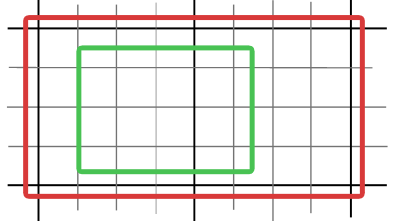

Labeling
==========

The tiling of rendered vector maps often results to issues with truncated or repeated labels. Some of these issues can be reduced with a proper configuration of MapProxy, but some require changes to the configuration of source WMS server.

This document describes these options for MapProxy and MapServer.

The Problem
-----------
MapProxy always uses small tiles for caching. MapProxy does not pass through incoming requests to the source WMS [#]_, but it splits the request into multiple tiles. These tiles are then cached and recombined for the final response.

When tiles are combined the text labels at the boundaries need to be present at both tiles and need to be placed at the exact same (geographical) location.

There are three common problems here:

No placement outside the BBOX
  WMS servers do not draw features that are outside of the map BBOX. E.g. a city label that extends into the neighboring map tile will not be drawn in that other tile, because the geographic feature of the city (a single point)  is only present in one tile.

Dynamic label placement
  WMS servers can adjust the position of labels so that more labels can fit on a map. E.g. a city label is not always displayed at the same geographic location, but moved around to make space for other labels.

Repeated labels
  WMS servers display labels for polygon areas in each request and so labels for large areas apear multiple times, once in each tile.
  
.. [#] Except for uncached, cascaded WMS requests.

meta-tiles
----------

You can use meta-tiles to reduce the labeling issues. A meta-tile is a collection of multiple tiles. Instead of requesting each tile with a single request, MapProxy requests a single image that covers the area of multiple tiles and then splits that response into the actual tiles.

The following image demonstrates that:

The thin lines represent the tiles. The WMS request (green/inner box) consists of 20 tiles and without metatiling each tile results in a request to the WMS source. With a meta-tile size of 4x4, only two larger requests to the source WMS are required (thick black lines).

Because you are requesting less images, you have less boundaries where labeling issues can appear. In this case it reduces the number of tile/image boundaries from 31 to only one.

But, it only reduces the problem and does not solve it. Nonetheless, it should be used because it also reduces the load on the source WMS server.

You can configure the meta-tile size in the ``globals.cache`` section or for each ``cache``. It defaults to ``[4, 4]``.

::

  globals:
    cache:
      meta_size: [6, 6]
  
  caches:
    mycache:
      sources: [...]
      grids: [...]
      meta_size: [8, 8]

meta-buffer
-----------

In addition to meta-tiles, MapProxy implements the meta-buffer. The meta-buffer adds pixels at the edge of the requested area (red square). This way labels positioned at the edge will be included in the request.

meta-tiles and meta-buffer can be configured in the settings:

::

  # add a buffer on all sides (in pixel)
  meta_buffer: 80 
  
  # size of the meta_tiling
  meta_tiling: [4,4]

To get optimal results, it is also important to adjust the map server. The fonts have to be positioned statically and shall not be drawn for each request to a new location. In almost all map servers you can disable the option for dynamic font positioning.

Some tipps and tricks for MapServer settings
--------------------------------------------

In our example we are working with the MapServer (http://mapserver.org). To achieve the best results for interaction between MapServer and MapProxy, there are some things you should consider. 

Some useful options in the MapServer:

``PROCESSING "LABEL_NO_CLIP"``
  With this option the labels are fixed to a feature. Default is off.

``FORCE``
  Draw every label regardless of collisions. Default is false.

``PARTIALS``
  If this option is true a label can run beyond the edge of a map. Default is true. 

Lets have a look at some examples for using this options. In our examples we use different settings, for different features:

Points
--------
Every point has only one label. For showing a lot of labels on a map it is useful to activate the option ``PARTIALS``. This way labels are drawn even if they run beyond the edge of the map. For not cutting the labels the meta-buffer from MapProxy is needed, too.

On the right side fewer labels are drawn, because ``PARTIALS`` is set to ``FALSE``

``PARTIALS TRUE``:
  .. image:: imgs/mapserver_points_partials_true.png

``PARTIALS FALSE``:
  .. image:: imgs/mapserver_points_partials_false.png

Areas
------
In areas only one label in each feature is useful. In many cases there are already good results by using meta-tiles from MapProxy. But in the following example there are two labels in one area. This is because the border of a meta-tile crosses the area.

In addition to the possibility of enlarging the meta_size, one can use the ``PROCESSING  "LABEL_NO_CLIP=ON"`` option in the MapServer to fix this problem. So the area has only one label that is attributed to the feature. If the ``PROCESSING LABEL_NO_CLIP`` option is used, ``PARTIALS`` has to be set ``TRUE``. Otherwise – assuming the requested area is at the edge of a meta-tile - the label of the area is lost. Additional an according meta-buffer has to be set in the configuration of the MapProxy.

``PROCESSING  "LABEL_NO_CLIP=ON"`` and ``PARTIALS TRUE``:
  .. image:: imgs/mapserver_area_with_labelclipping.png

``PROCESSING  "LABEL_NO_CLIP=OFF"`` and ``PARTIALS FALSE``:
  .. image:: imgs/mapserver_area_without_labelclipping.png

LineString
----------

For labels on streets like in a printed road atlas, the labels repeat depending on the length of the street. If this is intended, the ``PROCESSING LABEL_NO_CLIP`` option of the MapServer cannot be used. For good results a big meta-buffer in the MapProxy is needed. Also ``PARTIALS`` has to be set ``TRUE`` so that a lot of labels are drawn. In general these options generate good results, but some features have artifacts like cropped labels.

Another option to be sure that no labels are cropped the settings can be changed – accepting that some labels get lost. The ``PROCESSING LABEL_NO_CLIP`` option can be used, but zooming into the map one cannot see the label anymore. In this case the following options have to be set:

::
  
  PARTIALS FALSE
  PROCESSING "LABEL_NO_CLIP=ON" 
  meta_buffer: 0

Is a meta-buffer set in MapProxy and shouldn't or cannot be changed, it can be balanced by using the option ``LABELCACHE_MAP_EDGE_BUFFER`` in MapServer. The value of ``LABELCACHE_MAP_EDGE_BUFFER`` has to be the negative meta_buffer.

::

  METADATA
    LABELCACHE_MAP_EDGE_BUFFER "-80"
  END

It has to be evaluated which solution is the best for each application: some cropped or missing labels.

``PROCESSING  "LABEL_NO_CLIP=ON"`` and ``PARTIALS TRUE``:
  .. image:: imgs/mapserver_road_with_labelclipping.png

``PROCESSING  "LABEL_NO_CLIP=OFF"`` and ``PARTIALS FALSE``:
  .. image:: imgs/mapserver_road_without_labelclipping.png